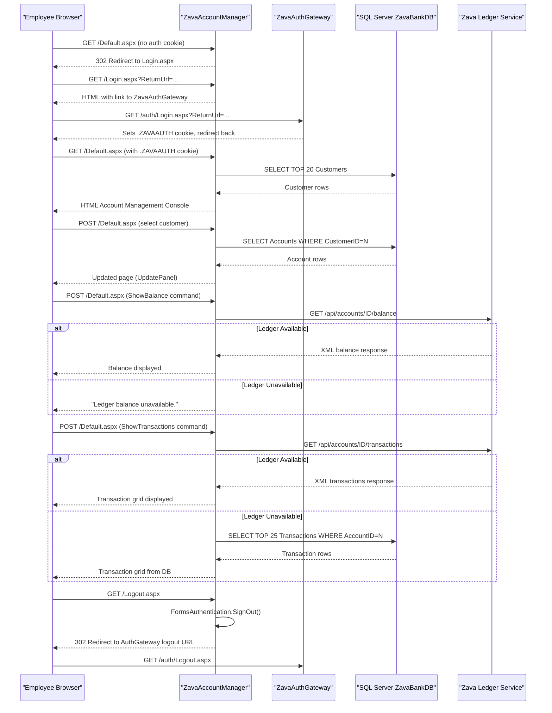

# API & Service Communication Contracts

ZavaAccountManager exposes no REST API; its user-facing surface consists of ASP.NET Web Forms pages (HTTP POST postbacks) and it acts as a **consumer** of two external services: the ZavaAuthGateway (authentication) and the Zava Ledger Service (balance and transaction data).

## Service Catalog

| Service | Port | Category | Purpose |
|---|---|---|---|
| ZavaAccountManager | 80 (IIS/HTTP) | Business | Employee-facing banking console; manages customer accounts via Web Forms UI |
| ZavaAuthGateway | configurable (AuthGatewayLoginUrl / AuthGatewayLogoutUrl) | Infrastructure | External SSO service that issues the Forms Authentication cookie; not part of this codebase |
| Zava Ledger Service | 8080 (LedgerBaseUrl default `zava-ledger:8080`) | Business | External HTTP/XML service exposing account balance and transaction history endpoints |
| SQL Server (ZavaBankDB) | 1433 | Infrastructure | Relational database storing Customers, Accounts, AccountTypes, and Transactions |

## API Endpoints Inventory

ZavaAccountManager does not expose REST API endpoints. Interaction occurs through ASP.NET Web Forms page lifecycle events (postbacks). The table below documents the page-level entry points and the external HTTP endpoints this application **calls**.

| Direction | Method | Path | Request Type | Response Type |
|---|---|---|---|---|
| Inbound (page) | GET / POST | `/Default.aspx` | Page postback (form fields, GridView commands) | HTML — account management console |
| Inbound (page) | GET / POST | `/Login.aspx` | QueryString `ReturnUrl` | HTML redirect to ZavaAuthGateway |
| Inbound (page) | GET | `/Logout.aspx` | None | Redirect to AuthGateway logout URL |
| Outbound (consumed) | GET | `/api/accounts/{accountId}/balance` | Path param `accountId` (int) | XML: `<balance>`, `<availableBalance>` |
| Outbound (consumed) | GET | `/api/accounts/{accountId}/transactions` | Path param `accountId` (int) | XML: list of `<transaction>` nodes |

## Management & Observability Endpoints

| Service | Endpoint | Notes |
|---|---|---|
| ZavaAccountManager | None | No health check, Swagger UI, or metrics endpoints are configured |

No management, health-check, or observability endpoints are present. `customErrors mode="Off"` in web.config means ASP.NET renders full exception detail to the browser in development, but no structured health endpoint exists.

## DTOs & Contracts

No formal DTO or contract classes are defined in this application. All data exchange between the UI and the database uses `System.Data.DataTable` objects populated via `SqlDataAdapter`, which are bound directly to `GridView` controls without a typed model layer.

Responses from the Zava Ledger Service are parsed as raw XML using `XmlDocument.SelectSingleNode(XPath)`. There is no deserialization into typed classes, no OpenAPI/Swagger specification, no protobuf schema, and no contract-testing library. Serialization is not configured beyond the default ASP.NET Web Forms view state.

## Communication Patterns

**Synchronous HTTP (outbound):** The `Default.aspx` code-behind calls the Zava Ledger Service using `HttpWebRequest` / `HttpWebResponse` — a legacy blocking I/O API. There is no `HttpClient`, no connection pooling, and no timeout configuration beyond the default (100 s).

**Database access:** All reads and writes to ZavaBankDB use inline `SqlConnection` / `SqlCommand` opened directly in page event handlers. No repository or service layer exists.

**Authentication delegation:** The application does not validate credentials itself. `Login.aspx` redirects the browser to the external ZavaAuthGateway login URL (configured in `AppSettings["AuthGatewayLoginUrl"]`). The gateway issues a Forms Authentication cookie (`.ZAVAAUTH`) which this app validates via `System.Web.Security.FormsAuthentication`. `Logout.aspx` calls `FormsAuthentication.SignOut()` and redirects to the gateway logout URL.

**Resilience:** No circuit breaker, retry policy, or timeout is configured for the Ledger service calls. The `GetBalance` and `BindTransactions` methods catch all exceptions silently — `GetBalance` returns the string `"Ledger balance unavailable."` and `BindTransactions` falls back to a direct SQL query against the local `Transactions` table.

**Service discovery:** Services are located via hardcoded base URLs stored in `web.config` `<appSettings>` (`AuthGatewayLoginUrl`, `AuthGatewayLogoutUrl`, `LedgerBaseUrl`). There is no service registry or DNS-based discovery.

**Security posture:** The application is served over plain HTTP (no TLS/HTTPS configuration present). All pages except `Login.aspx` and `Logout.aspx` require an authenticated Forms Authentication cookie (`<deny users="?" />` in `web.config`). No role-based authorization (`<allow roles="...">`) is applied beyond the cookie check. The `machineKey` (used for cookie signing/encryption) is hardcoded in `web.config` with static values, which is a security risk if the config is committed to source control.

## Service Technology Matrix

| Service | Web | Data Access | Discovery | Gateway | Health Checks | Cache | Metrics |
|---|---|---|---|---|---|---|---|
| ZavaAccountManager | ASP.NET Web Forms 4.8 | ADO.NET SqlClient (inline) | None — config URL | None | None | None | None |
| ZavaAuthGateway | Unknown (external) | — | — | — | — | — | — |
| Zava Ledger Service | HTTP/XML (external) | — | — | — | — | — | — |

## Service Communication Sequence

