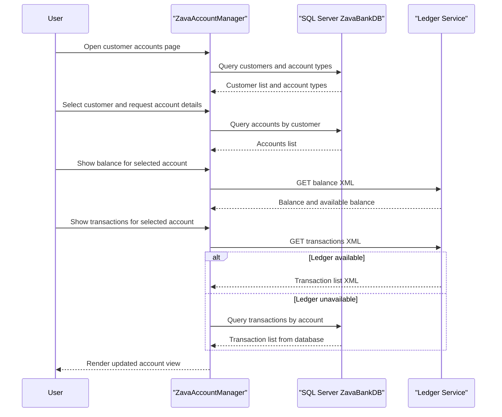

# API & Service Communication Contracts

This application exposes user functionality through ASP.NET Web Forms pages and communicates with backend services synchronously over SQL and HTTP. No standalone REST controller surface is implemented in this repository.

## Service Catalog

| Service | Port | Category | Purpose |
|---|---|---|---|
| ZavaAccountManager | 80 (IIS default) / 8080 (container xsp4) | API Layer | User facing account management web application |
| SQL Server ZavaBankDB | 1433 | Business | Stores customers, accounts, account types, and transactions |
| Zava Ledger Service | 8080 | Business | Provides account balance and transaction feed endpoints |

## API Endpoints Inventory

| Service | Method | Path | Request Type | Response Type |
|---|---|---|---|---|
| ZavaAccountManager | GET | /Default.aspx | Browser request with auth cookie | HTML page response |
| ZavaAccountManager | GET | /Login.aspx | Browser request | HTML page response |
| ZavaAccountManager | GET | /Logout.aspx | Browser request | Redirect and auth cookie clearance |
| Zava Ledger Service | GET | /api/accounts/{accountId}/balance | Path parameter accountId | XML balance payload |
| Zava Ledger Service | GET | /api/accounts/{accountId}/transactions | Path parameter accountId | XML transaction collection |

## Management & Observability Endpoints

| Service | Endpoint | Custom Metrics (if any) |
|---|---|---|
| ZavaAccountManager | None detected | None detected |
| Zava Ledger Service | Not defined in this repository | Unknown |

## DTOs & Contracts

The web application uses Web Forms controls and DataTable based contracts internally rather than strongly typed API DTO classes. External service communication is XML based where balance and transaction elements are parsed from ledger responses, while SQL result sets are bound directly to GridView controls. No OpenAPI, protobuf, or GraphQL schema artifacts were detected.

## Communication Patterns

Communication is synchronous and request response based. The application reads and writes core account data through SQL Server using direct ADO.NET commands and calls ledger endpoints over HTTP using hardcoded base URL configuration. A resilience fallback exists for transaction history where ledger call failures trigger a local database query, but no formal retry or circuit breaker library is configured. Service discovery is not used and endpoints are configured as direct URLs. No TLS, token authentication, or role based API authorization controls were detected at service contract level beyond Forms authentication for web page access.

## Service Technology Matrix

| Service | Web | Data Access | Discovery | Gateway | Actuator | Cache | Metrics |
|---|---|---|---|---|---|---|---|
| ZavaAccountManager | ASP.NET Web Forms | ADO.NET SqlClient | None | No | No | No | No |
| SQL Server ZavaBankDB | N A | Relational engine | None | No | No | N A | No |
| Zava Ledger Service | Unknown external service | Unknown | None detected | No | Unknown | Unknown | Unknown |

## Service Communication Sequence

