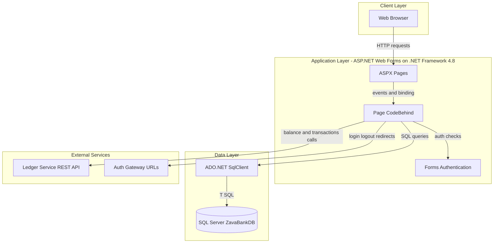
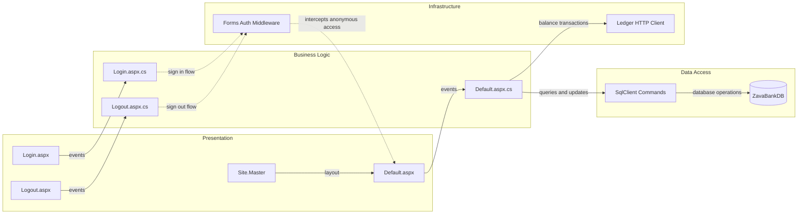

# Architecture Diagram

This document summarizes the current application architecture and key internal component relationships for ZavaAccountManager.

## Application Architecture

### Technology Stack Summary

| Layer | Technology | Version | Purpose |
|---|---|---|---|
| Presentation | ASP.NET Web Forms | .NET Framework 4.8 | Server rendered UI for account management |
| Business Logic | C# code behind classes | .NET Framework 4.8 | Handles page events and account operations |
| Data Access | System.Data.SqlClient | .NET Framework library | Executes SQL against banking database |
| Integration | HttpWebRequest and XML parsing | .NET Framework library | Calls ledger service endpoints |

### Data Storage & External Services

The application stores customer and account data in a SQL Server database using direct ADO.NET commands. It also integrates with an external ledger service over HTTP for balance and transaction history and relies on configured login and logout gateway URLs for authentication flow.

### Key Architectural Decisions

- Uses server side Web Forms event model with code behind orchestration instead of API first controller patterns.
- Uses direct SQL command execution with `SqlConnection`, `SqlCommand`, and `SqlDataAdapter` rather than an ORM.
- Uses synchronous HTTP calls from page code for ledger integration and falls back to database reads when remote transaction retrieval fails.

## Component Relationships

### Component Inventory

| Component | Layer | Type | Responsibility |
|---|---|---|---|
| Default.aspx | Presentation | Web Forms Page | Main account management UI |
| Login.aspx | Presentation | Web Forms Page | User authentication entry point |
| Logout.aspx | Presentation | Web Forms Page | Sign out flow |
| Site.Master | Presentation | Master Page | Shared page layout and navigation |
| Default.aspx.cs | Business Logic | Code behind class | Coordinates account queries, updates, and external calls |
| Login.aspx.cs | Business Logic | Code behind class | Handles login behavior |
| Logout.aspx.cs | Business Logic | Code behind class | Handles logout behavior |
| SqlClient Commands | Data Access | ADO.NET data access | Executes SQL statements |
| Forms Auth Middleware | Infrastructure | Authentication component | Controls access to authenticated pages |
| Ledger HTTP Client | Infrastructure | External integration client | Retrieves account balance and transaction data |
