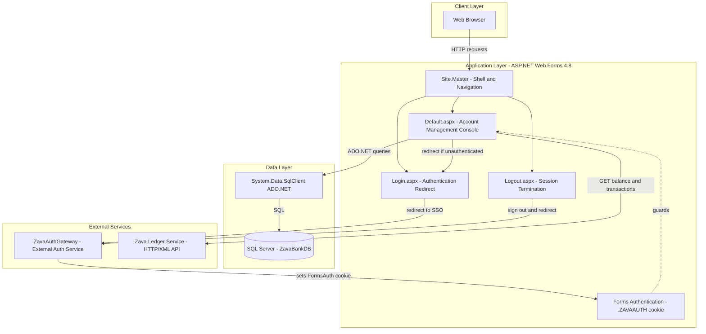
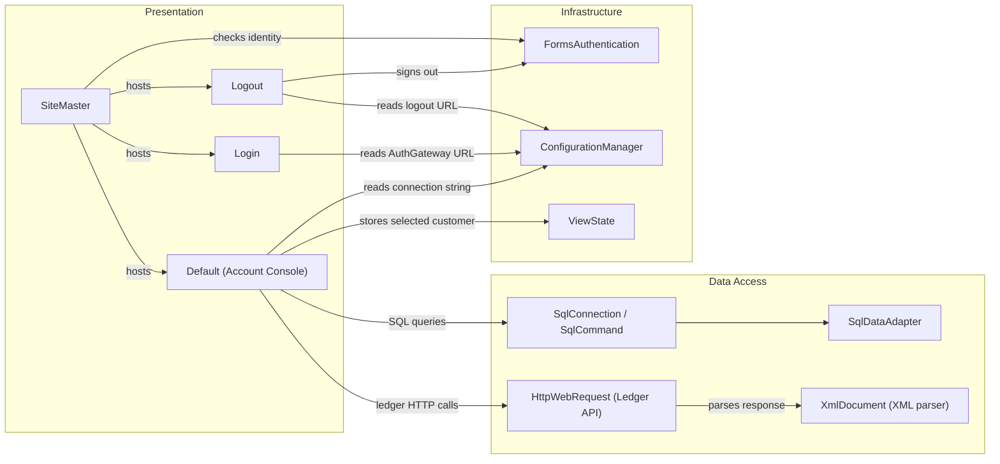

# Architecture Diagram

ZavaAccountManager is an ASP.NET Web Forms employee-facing banking console that manages customer accounts and delegates authentication to an external gateway and balance/transaction data to an external ledger service.

## Application Architecture

### Technology Stack Summary

| Layer | Technology | Version | Purpose |
|---|---|---|---|
| Presentation | ASP.NET Web Forms | 4.8 | Server-side rendered UI pages |
| Presentation | ASP.NET ScriptManager / UpdatePanel | 4.8 | Partial-page AJAX rendering |
| Security | ASP.NET Forms Authentication | 4.8 | Cookie-based session management |
| Data Access | ADO.NET (System.Data.SqlClient) | 4.8 | Direct SQL queries to SQL Server |
| Runtime | .NET Framework | 4.8 | Application host |
| Web Server | IIS / ASP.NET pipeline | - | HTTP request processing |

### Data Storage & External Services

The application uses a single SQL Server database (`ZavaBankDB`) accessed directly via ADO.NET without an ORM. It reads and writes to `Customers`, `Accounts`, `AccountTypes`, and `Transactions` tables. Balance and transaction history can also be fetched from the **Zava Ledger Service** (`zava-ledger:8080`) over HTTP with XML responses, falling back to the database when the ledger is unavailable. User authentication is fully delegated to the **ZavaAuthGateway** external service; this application only hosts the redirect/logout pages and validates the resulting Forms Authentication cookie.

### Key Architectural Decisions

- **No ORM** — all data access uses inline ADO.NET `SqlCommand` calls with parameterised queries directly in page code-behind classes.
- **Delegated authentication** — the application does not perform credential validation itself; it redirects unauthenticated users to an external ZavaAuthGateway URL and trusts the resulting cookie.
- **Ledger service with SQL fallback** — balance and transaction data are retrieved from the Ledger HTTP service first; on failure the application silently falls back to a direct SQL query against the local `Transactions` table.

## Component Relationships

### Component Inventory

| Component | Layer | Type | Responsibility |
|---|---|---|---|
| SiteMaster | Presentation | MasterPage | Renders the application shell, navigation bar, and login/logout links; displays authenticated user name |
| Default (Account Console) | Presentation | Web Forms Page | Lists customers, shows account details, displays balances and transactions, opens and closes accounts |
| Login | Presentation | Web Forms Page | Redirects unauthenticated employees to the external ZavaAuthGateway login URL |
| Logout | Presentation | Web Forms Page | Signs out the Forms Authentication session and redirects to the AuthGateway logout URL |
| SqlConnection / SqlCommand | Data Access | ADO.NET | Executes parameterised SQL against ZavaBankDB (SELECT, INSERT, UPDATE) |
| SqlDataAdapter | Data Access | ADO.NET | Fills DataTable results for GridView binding |
| HttpWebRequest (Ledger API) | Data Access | HTTP Client | Calls `zava-ledger:8080` REST endpoints to retrieve balance and transaction XML |
| XmlDocument | Data Access | XML Parser | Parses ledger XML responses to extract balance and transaction fields |
| FormsAuthentication | Infrastructure | ASP.NET Security | Manages `.ZAVAAUTH` cookie lifecycle (sign-out) |
| ConfigurationManager | Infrastructure | Configuration | Reads connection strings and app settings (AuthGatewayLoginUrl, AuthGatewayLogoutUrl, LedgerBaseUrl) |
| ViewState | Infrastructure | State Management | Persists the selected CustomerID across postbacks on the account management page |
