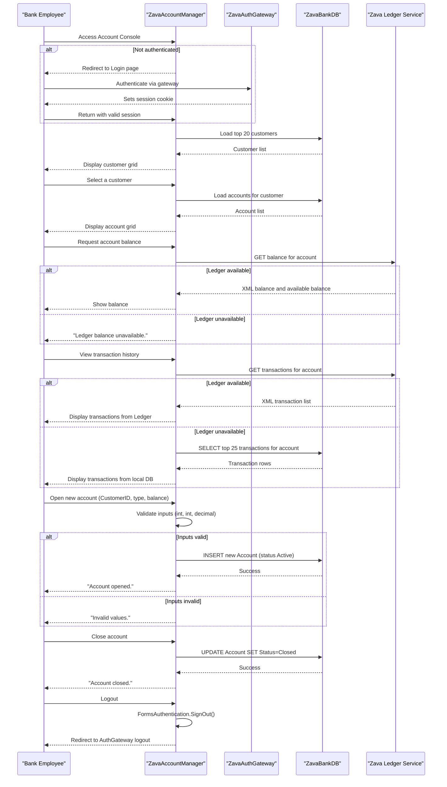

# Core Business Workflows

ZavaAccountManager is an employee-facing banking console that allows bank staff (admins and tellers) to manage customer bank accounts — viewing customer lists, inspecting account details, checking balances and transactions, opening new accounts, and closing existing ones.

## Domain Entities

| Entity | Service / Bounded Context | Description | Key Relationships |
|---|---|---|---|
| Customer | Account Management | A bank customer whose accounts are managed by staff | Owns one or more Accounts |
| Account | Account Management | A bank account belonging to a customer with a type, balance, and lifecycle status | Belongs to a Customer; has an AccountType; has Transactions |
| AccountType | Account Management | A classification for accounts (e.g., Checking, Savings) that is active or inactive | Referenced by Accounts |
| Transaction | Account Management / Ledger | A financial transaction record associated with an account | Belongs to an Account; authoritative source is the Ledger Service |
| Employee (implicit) | Authentication (ZavaAuthGateway) | A bank employee whose identity is verified by the external auth gateway | Not stored locally; represented by the Forms Authentication identity |

## Service-to-Domain Mapping

| Service | Domain Context | Owned Entities | External Dependencies |
|---|---|---|---|
| ZavaAccountManager | Account Management | Customer, Account, AccountType, Transaction (local fallback copy) | ZavaAuthGateway (authentication), Zava Ledger Service (live balance and transaction data) |
| ZavaAuthGateway | Employee Identity | Employee credentials and session (external; not in this codebase) | None visible from this codebase |
| Zava Ledger Service | Financial Ledger | Authoritative Transaction and Balance records (external) | None visible from this codebase |

## Primary Workflows

### Workflow 1: Employee Login

An unauthenticated employee who visits any protected page is redirected to `Login.aspx`, which redirects them to the external ZavaAuthGateway. The gateway authenticates the employee and issues a `.ZAVAAUTH` Forms Authentication cookie. On return, the employee is redirected to the originally requested page (the `ReturnUrl` parameter). If already authenticated, `Login.aspx` redirects directly to the return URL.

Steps:
1. Employee navigates to a protected page (e.g., `/Default.aspx`).
2. ASP.NET Forms Authentication detects no valid cookie → redirects to `Login.aspx?ReturnUrl=...`.
3. `Login.aspx` builds the ZavaAuthGateway URL (appending the `ReturnUrl`) and renders a link.
4. Employee clicks through to ZavaAuthGateway, which validates credentials and sets `.ZAVAAUTH` cookie.
5. Employee is redirected back to the original page with a valid session.

### Workflow 2: View Customer List and Select a Customer

An authenticated employee loads the Account Management Console (`Default.aspx`), which retrieves and displays the most recent 20 customers. The employee selects a customer to load that customer's accounts.

Steps:
1. Page load: top 20 customers are fetched from `ZavaBankDB.Customers` ordered by `CustomerID`.
2. Customer grid is rendered; account type dropdown is also populated.
3. Employee selects a customer row → `gvCustomers_SelectedIndexChanged` fires.
4. Selected `CustomerID` is stored in ViewState.
5. Accounts for the selected customer are fetched from `ZavaBankDB.Accounts` and displayed.

### Workflow 3: Check Account Balance

An employee clicks the **Balance** button on an account row to retrieve the live balance from the external Ledger Service, with a graceful fallback message if the service is unavailable.

Steps:
1. Employee clicks "Balance" for an account row → `gvAccounts_RowCommand` fires with command `ShowBalance`.
2. Application calls the Ledger Service `GET /api/accounts/{accountId}/balance`.
3. If the Ledger responds: XML is parsed for `<balance>` and `<availableBalance>` and displayed in `lblBalanceResult`.
4. If the Ledger is unavailable: `"Ledger balance unavailable."` is displayed — no exception is propagated.

### Workflow 4: View Transaction History

An employee clicks **Transactions** on an account row. The application first attempts to load transactions from the Ledger Service and falls back to the local database if the service is unavailable.

Steps:
1. Employee clicks "Transactions" → `gvAccounts_RowCommand` fires with command `ShowTransactions`.
2. Application calls Ledger Service `GET /api/accounts/{accountId}/transactions`.
3. If the Ledger responds: XML `<transaction>` nodes are parsed and bound to the transaction grid.
4. If the Ledger is unavailable: the top 25 most recent rows are fetched from `ZavaBankDB.Transactions` for the account instead.

### Workflow 5: Open a New Account

An employee fills in a form to open a new bank account for a customer and submits it.

Steps:
1. Employee enters a `CustomerID`, selects an `AccountType`, and enters an opening balance (default `100.00`).
2. On submit, `fvOpenAccount_ItemInserting` fires.
3. Inputs are validated: `CustomerID` must be a valid integer, `AccountTypeID` must be a valid integer, opening balance must be a valid decimal.
4. If validation fails: the insert is cancelled and `"Invalid values."` is shown.
5. If validation passes: a new row is inserted into `ZavaBankDB.Accounts` with status `'Active'`, a generated `AccountNumber` (timestamp + customer ID suffix), and the opening balance set as both `Balance` and `AvailableBalance`.
6. The account list for the customer is refreshed and `"Account opened."` is shown.

### Workflow 6: Close an Account

An employee clicks **Close Account** on an account row to mark that account as closed.

Steps:
1. Employee clicks "Close Account" → `gvAccounts_RowCommand` fires with command `CloseAccount`.
2. Application validates the row index is in range.
3. `UPDATE Accounts SET Status='Closed', CloseDate=GETDATE(), ModifiedDate=GETDATE() WHERE AccountID=@i` is executed.
4. The account list is refreshed and `"Account closed."` is shown.

### Workflow 7: Employee Logout

An employee navigates to `Logout.aspx` or clicks the Logout link.

Steps:
1. `Page_Load` on `Logout.aspx` fires.
2. `FormsAuthentication.SignOut()` clears the `.ZAVAAUTH` cookie locally.
3. Employee is redirected to `AuthGatewayLogoutUrl` to complete the session termination at the gateway.

## Cross-Service Data Flows

**Balance data:** The Zava Ledger Service is the authoritative source for account balances. ZavaAccountManager issues a synchronous HTTP GET call per balance request and displays the result inline. There is no data stored locally from this call — it is a live read-through.

**Transaction data — dual source:** Transaction history uses a fallback pattern. The primary source is the Ledger Service (live, authoritative). If the Ledger is unavailable, the application reads from the local `Transactions` table, which may be stale. The two sources are not synchronised within the application; consistency is assumed to be managed externally.

**Authentication — full delegation:** No user credentials or identity data flow through ZavaAccountManager. The employee browser is redirected to ZavaAuthGateway, which issues a cookie that ZavaAccountManager trusts. The only identity data available to the application is the `User.Identity.Name` from the validated cookie.

## Business Workflow Sequence

## Business Rules & Decision Logic

**Validation rules:**
- **Open Account**: `CustomerID` must parse as a non-default integer; `AccountTypeID` must be a valid integer from the dropdown; opening balance must parse as a decimal. Any failure cancels the insert and shows `"Invalid values."` — no field-level error messages are provided.
- **Account type population**: Only `AccountTypes` with `IsActive = 1` are shown in the dropdown.
- **Close Account**: The row index from the GridView command argument must be a non-negative integer within bounds; if not, the command is silently ignored.

**State transitions:**
- Account lifecycle: `Active` (on open) → `Closed` (on close). No intermediate states, no reopening workflow.
- `CloseDate` and `ModifiedDate` are set to `GETDATE()` on closure; no other fields change.

**Business constraints:**
- Customer list is capped at 20 records ordered by `CustomerID` (no pagination).
- Transaction history from the local database fallback is capped at 25 records ordered by most recent date.
- Account numbers are generated as a timestamp string (`yyMMddHHmmss`) concatenated with a zero-padded `CustomerID`; no uniqueness check is performed in the application before insert.

**Computed values:**
- `AccountNumber` is generated at insert time: `DateTime.UtcNow.ToString("yyMMddHHmmss") + customerId.ToString("00")`.
- Opening `Balance` and `AvailableBalance` are both set to the supplied opening balance value.

**Transaction management:**
- No explicit transaction scope (no `TransactionScope`, no `BEGIN TRANSACTION`). Each `SqlCommand` is executed in its own auto-commit connection. Multi-step operations (e.g., opening an account) are not atomic at the database level.

**Error handling:**
- Ledger service failures are caught with a blanket `catch` and silently swallowed — either returning a fallback string or falling back to the local database. No error is logged.
- Input validation failures show inline label messages (`lblActionStatus`) with no structured exception handling.

**Authorization:**
- All pages except `Login.aspx` and `Logout.aspx` require a valid `.ZAVAAUTH` Forms Authentication cookie.
- No role-based or attribute-based authorization is applied; any authenticated employee can perform all operations (view, open, close accounts) for any customer.

**Audit / logging:**
- No audit logging, change tracking, or event sourcing is implemented. Account closures and openings leave no application-level audit trail beyond what the database timestamps (`CreatedDate`, `ModifiedDate`, `CloseDate`) record.
