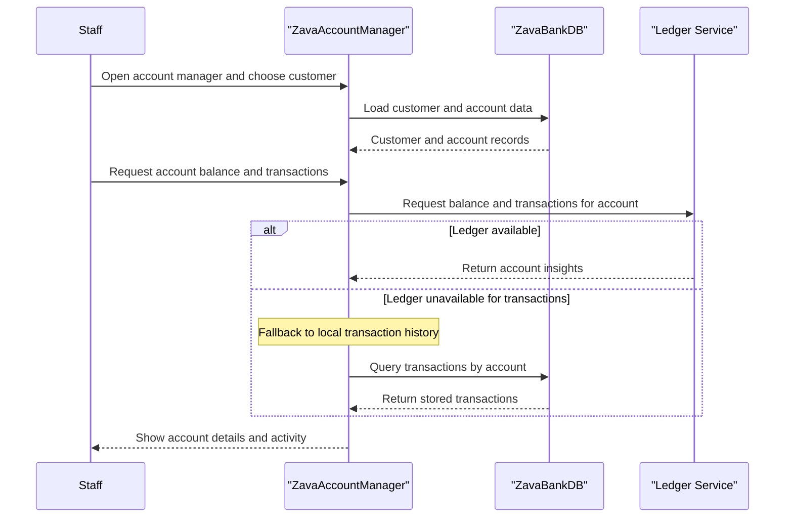

# Core Business Workflows

This application supports bank operations staff with customer account lookup, account lifecycle management, and balance or transaction visibility. Workflows are centered on selecting a customer, managing accounts, and retrieving account history.

## Domain Entities

| Entity | Service / Bounded Context | Description | Key Relationships |
|---|---|---|---|
| Customer | Account Management | Bank customer record used as anchor for account views | One customer to many accounts |
| Account | Account Management | Deposit account with status and balances | Belongs to customer and account type |
| AccountType | Account Management | Classification for account opening options | One account type to many accounts |
| Transaction | Account Activity | Financial activity events for accounts | One account to many transactions |

## Service-to-Domain Mapping

| Service | Domain Context | Owned Entities | External Dependencies |
|---|---|---|---|
| ZavaAccountManager | Account Management | Customer, Account, AccountType, Transaction | SQL Server database, Ledger service |
| Zava Ledger Service | Balance and History | Balance and transaction feed data | Not defined in this repository |

## Primary Workflows

### Workflow 1: View Customer Accounts

1. Authenticated user opens the account management page.
2. System loads customer list and account types from database.
3. User selects a customer and system retrieves associated accounts.
4. UI binds results for account actions.

Business rules involved: authenticated access required, selected customer context persisted in view state.

### Workflow 2: Open New Account

1. User enters customer ID, selects account type, and enters opening balance.
2. System validates numeric input for customer ID, account type, and opening balance.
3. If valid, system inserts account record with active status and generated account number.
4. Updated account list is returned for the selected customer.

Business rules involved: invalid numeric input cancels insert; newly created accounts default to active.

### Workflow 3: Account Insight and Closure

1. User chooses account action for close, show balance, or show transactions.
2. Close action updates account status to closed and sets close and modified timestamps.
3. Balance action requests ledger balance endpoint and shows parsed result.
4. Transaction action requests ledger transactions; if unavailable, uses database fallback query.

Business rules involved: close action mutates state to closed; transaction visibility degrades gracefully on ledger outages.

## Cross-Service Data Flows

Cross service composition happens inside the web application. Core account data is sourced from SQL Server, while balance and transaction enrichment is requested from the ledger service using account ID. If ledger transactions are unavailable, the workflow returns transaction history from local database queries so users still receive usable account activity data.

## Business Workflow Sequence

## Business Rules & Decision Logic

- Access rule: unauthenticated requests are redirected to login before workflow execution.
- Input validation rule: account opening requires integer customer and account type identifiers and decimal opening balance.
- State transition rule: account status can transition from active to closed through the close action.
- Fallback decision rule: failed ledger transaction retrieval triggers local database query path.
- Integrity rule: customer selection is stored and reused to scope account updates and refreshes.
