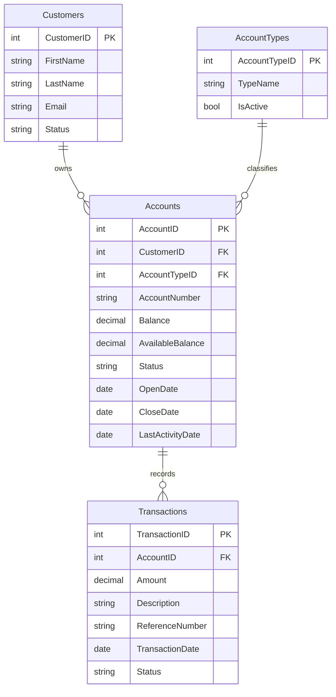

# Data Architecture & Persistence Layer

This application uses a SQL Server backed persistence layer accessed with ADO.NET and DataTable bindings. The repository does not define ORM entity classes, so data modeling is inferred from SQL queries used in page logic.

## Database Configuration

| Service/Module | DB Type | Profile | Driver | Connection | Migration Tool |
|---|---|---|---|---|---|
| ZavaAccountManager | SQL Server | Default web.config | System.Data.SqlClient | Server sqlserver,1433; Database ZavaBankDB | None detected |

## Data Ownership per Service

| Service | Tables Owned | ORM Framework | Caching | Notes |
|---|---|---|---|---|
| ZavaAccountManager | Customers, Accounts, AccountTypes, Transactions | None (ADO.NET direct SQL) | None detected | Single app module with shared relational data store |

## Entity Model

## Key Repository Methods

| Service | Repository | Notable Methods | Purpose |
|---|---|---|---|
| ZavaAccountManager | Inline ADO.NET in Default.aspx.cs | SELECT TOP 20 CustomerID, FirstName, LastName, Email, Status FROM Customers | Loads customer grid data |
| ZavaAccountManager | Inline ADO.NET in Default.aspx.cs | SELECT AccountID, AccountNumber, Balance, AvailableBalance, Status, OpenDate FROM Accounts WHERE CustomerID=@c | Loads accounts for selected customer |
| ZavaAccountManager | Inline ADO.NET in Default.aspx.cs | INSERT INTO Accounts (...) VALUES (...) | Creates new account records |
| ZavaAccountManager | Inline ADO.NET in Default.aspx.cs | UPDATE Accounts SET Status='Closed', CloseDate=GETDATE() WHERE AccountID=@i | Closes an existing account |
| ZavaAccountManager | Inline ADO.NET in Default.aspx.cs | SELECT TOP 25 ... FROM Transactions WHERE AccountID=@a | Fallback transaction history query |

## Caching Strategy

No explicit application cache provider or cache policy configuration was detected. Data retrieval appears request scoped with direct database or external service reads on each interaction.

## Data Ownership Boundaries

The repository represents a single service boundary with one shared SQL Server database. Cross service read composition occurs at application level when account data is read from SQL Server and enrichment data (balances and transactions) is requested from the external ledger API. Write operations for account lifecycle remain local to the SQL database.

### Data Classification & Sensitivity

| Entity | Sensitive Fields | Classification (PII/PHI/PCI/None) | Controls in Place |
|---|---|---|---|
| Customers | FirstName, LastName, Email | PII | No masking or encryption controls detected in repository |
| Accounts | AccountNumber, Balance, AvailableBalance | Confidential financial data | No field level controls detected in repository |
| Transactions | Amount, Description, ReferenceNumber | Confidential financial data | No field level controls detected in repository |
| AccountTypes | TypeName | None | N A |
