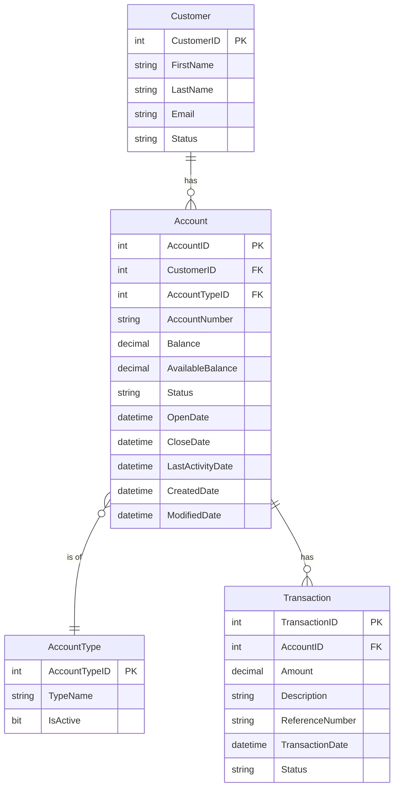

# Data Architecture & Persistence Layer

ZavaAccountManager accesses a single SQL Server database (`ZavaBankDB`) using inline ADO.NET without an ORM; the data model is inferred from parameterised SQL queries in the page code-behind files since no entity classes exist.

## Database Configuration

| Service / Module | DB Type | Profile | Driver | Connection | Migration Tool |
|---|---|---|---|---|---|
| ZavaAccountManager | SQL Server | All (single environment) | System.Data.SqlClient (BCL) | `Server=sqlserver,1433;Database=ZavaBankDB;User Id=sa;TrustServerCertificate=true` — hardcoded in `web.config` | None — no schema migration tooling is present; schema is managed externally |

No connection pooling configuration is explicitly set; the default ADO.NET connection pool behaviour applies. Schema creation and seed data are not managed by the application.

## Data Ownership per Service

| Service | Tables Owned | ORM Framework | Caching | Notes |
|---|---|---|---|---|
| ZavaAccountManager | Customers, Accounts, AccountTypes, Transactions | None — inline ADO.NET | None | All SQL is written directly in ASPX code-behind event handlers; no repository or service layer |

## Entity Model

> Note: No entity classes exist in this codebase. The schema below is inferred from SQL queries found in `Default.aspx.cs`.

## Key Repository Methods

There are no repository interfaces in this codebase. All data access is implemented as private methods directly inside the `Default` page class (`Default.aspx.cs`).

| Service | Method | SQL Operation | Purpose |
|---|---|---|---|
| Default (code-behind) | `BindCustomers()` | `SELECT TOP 20 CustomerID, FirstName, LastName, Email, Status FROM Customers ORDER BY CustomerID` | Populates the customer grid on page load |
| Default (code-behind) | `BindAccounts(int customerId)` | `SELECT AccountID, AccountNumber, Balance, AvailableBalance, Status, OpenDate FROM Accounts WHERE CustomerID=@c` | Loads accounts for the selected customer |
| Default (code-behind) | `BindAccountTypes()` | `SELECT AccountTypeID, TypeName FROM AccountTypes WHERE IsActive=1 ORDER BY TypeName` | Fills the account-type dropdown |
| Default (code-behind) | `GetBalance(int accountId)` | HTTP GET to Ledger `/api/accounts/{id}/balance` (XML) | Retrieves live balance from external ledger |
| Default (code-behind) | `BindTransactions(int accountId)` | HTTP GET to Ledger `/api/accounts/{id}/transactions` (XML); falls back to `SELECT TOP 25 FROM Transactions WHERE AccountID=@a` | Retrieves transaction history from ledger or local DB |
| Default (code-behind) | `gvAccounts_RowCommand — CloseAccount` | `UPDATE Accounts SET Status='Closed', CloseDate=GETDATE(), ModifiedDate=GETDATE() WHERE AccountID=@i` | Closes an account |
| Default (code-behind) | `fvOpenAccount_ItemInserting` | `INSERT INTO Accounts (CustomerID, AccountTypeID, AccountNumber, Balance, ...) VALUES (...)` | Opens a new bank account |

## Caching Strategy

No caching layer is configured. There is no use of `HttpRuntime.Cache`, `MemoryCache`, `IDistributedCache`, Redis, or any other caching provider. Every page request that requires data issues a fresh SQL query or HTTP call. Frequently read, rarely changing data such as `AccountTypes` is re-queried on every postback.

## Data Ownership Boundaries

ZavaAccountManager is the sole application accessing `ZavaBankDB`; there is no database-per-service or logical schema separation. All four tables (`Customers`, `Accounts`, `AccountTypes`, `Transactions`) are owned by this single application.

Balance and transaction data have a **dual-source pattern**: the authoritative source for live balance and transaction history is the external Zava Ledger Service (HTTP/XML). The local `Transactions` table acts as a read fallback only when the ledger is unavailable. This creates an implicit data consistency risk: the local table may be stale or incomplete relative to the ledger.

There are no CQRS patterns, no outbox tables, and no event-driven data synchronisation between the local database and the ledger service.

### Data Classification & Sensitivity

| Entity | Sensitive Fields | Classification | Controls in Place |
|---|---|---|---|
| Customer | FirstName, LastName, Email | PII | None — no encryption-at-rest, no field-level masking, no access control beyond Forms Authentication cookie |
| Account | AccountNumber, Balance, AvailableBalance | PCI-adjacent (financial account data) | None — data is read and displayed in plaintext; no column-level encryption or masking |
| Transaction | Amount, Description, ReferenceNumber | PCI-adjacent (financial transaction data) | None — no encryption, masking, or audit logging configured |
| AccountType | TypeName, IsActive | None | N/A |

The application stores customer PII (name, email) and financial account/transaction data with no encryption-at-rest, no data masking, and no column-level access controls. The database connection string in `web.config` contains a plaintext password (`Zava123!`) and is committed to source control.
