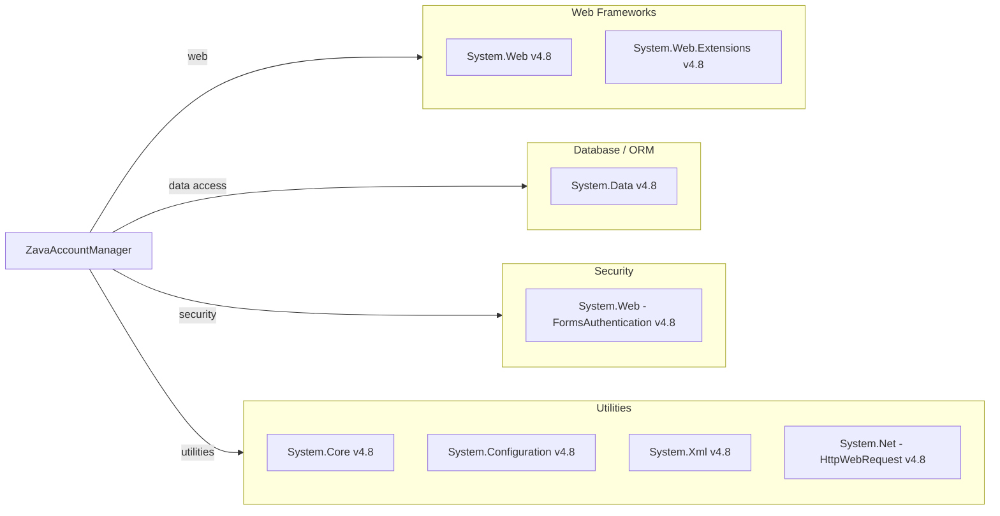

# Dependency Map

ZavaAccountManager declares no third-party NuGet packages. All dependencies are .NET Framework 4.8 built-in (BCL/FCL) assemblies referenced directly in the project file.

## Dependencies

### Dependency Summary

| Category | Count | Key Libraries | Notes |
|---|---|---|---|
| Web Frameworks | 2 | System.Web 4.8, System.Web.Extensions 4.8 | ASP.NET Web Forms on .NET Framework 4.8; includes ScriptManager/UpdatePanel for AJAX |
| Database / ORM | 1 | System.Data 4.8 | ADO.NET with inline SqlCommand; no ORM |
| Security | 1 | System.Web FormsAuthentication 4.8 | Cookie-based Forms Authentication; delegated to external gateway |
| Utilities | 4 | System.Core 4.8, System.Configuration 4.8, System.Xml 4.8, System.Net 4.8 | Core BCL assemblies for LINQ, config reading, XML parsing, and HTTP calls |

### Version & Compatibility Risks

All dependencies are part of **.NET Framework 4.8**, which is the final major release of the legacy .NET Framework and is in long-term maintenance mode (security fixes only, no new features). Microsoft recommends migrating workloads to .NET 6+ (or .NET 8 LTS / .NET 10). `System.Web` — the foundation of ASP.NET Web Forms — is **not available on modern .NET** and has no direct in-place upgrade path; migration requires rewriting UI pages to ASP.NET Core MVC, Razor Pages, or Blazor. `System.Data.SqlClient` used inline in code-behind is superseded by `Microsoft.Data.SqlClient`, which receives active maintenance and new features.

### Notable Observations

- **No third-party NuGet packages** — the project relies exclusively on .NET Framework BCL/FCL assemblies. While this minimises supply-chain risk, it also means no modern abstractions (DI, ORM, HTTP client factory) are in use.
- **System.Web hard dependency** — `System.Web` is the single largest modernisation blocker; the entire Web Forms page lifecycle, UpdatePanel AJAX pattern, and code-behind model must be re-evaluated when targeting .NET 8+.
- **Inline ADO.NET without connection pooling guard** — `System.Data.SqlClient` connections are opened directly in page event handlers with no repository or service layer, making them difficult to test or replace.
- **HttpWebRequest for external HTTP calls** — `System.Net.HttpWebRequest` is a legacy API superseded by `HttpClient`; calls to the Ledger service use no retry logic, timeout configuration, or connection management.

## Test Dependencies

No test-scoped dependencies detected.

Total test-scope dependencies: 0

No test project or test framework references were found. The solution contains no unit or integration tests.
