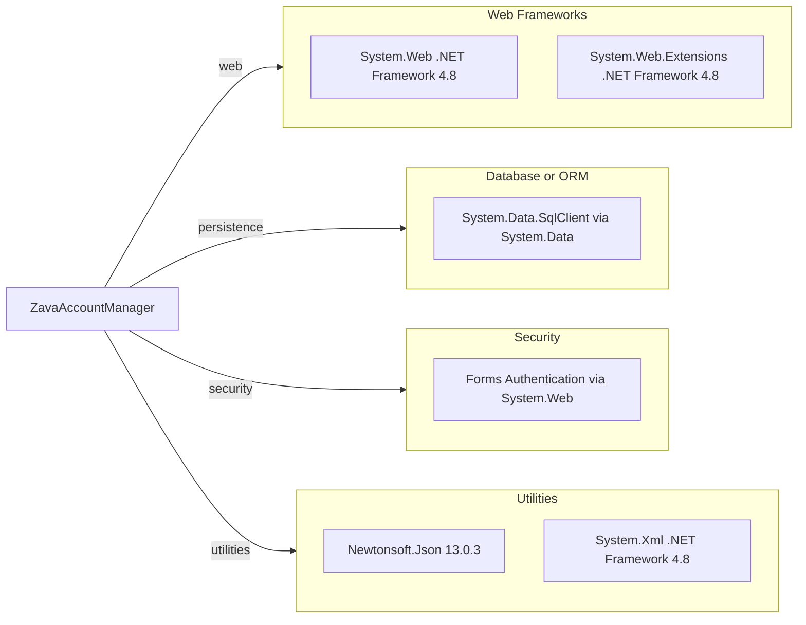

# Dependency Map

This map summarizes declared external dependencies for ZavaAccountManager. The project declares one primary external package and several framework assemblies.

## Dependencies

### Dependency Summary

| Category | Count | Key Libraries | Notes |
|---|---:|---|---|
| Web Frameworks | 2 | System.Web, System.Web.Extensions | ASP.NET Web Forms on .NET Framework |
| Database or ORM | 1 | System.Data SqlClient | Direct ADO.NET SQL access |
| Security | 1 | Forms Authentication in System.Web | Cookie based authentication in web.config |
| Utilities | 2 | Newtonsoft.Json 13.0.3, System.Xml | JSON package declared in packages.config, XML parsing used in code |

### Version & Compatibility Risks

The project targets .NET Framework 4.8, which constrains modernization options on Linux based runtimes and requires migration to newer .NET for full cross platform hosting. Data access is based on System.Data.SqlClient, and modernization guidance recommends evaluating migration to Microsoft.Data.SqlClient.

### Notable Observations

- `packages.config` only declares `Newtonsoft.Json`, indicating low external package count with heavy reliance on framework assemblies.
- Most dependencies are from the .NET Framework shared library set rather than NuGet managed packages.
- Test libraries are not declared, which suggests no established automated test dependency stack in this repository.

## Test Dependencies

| Framework | Version | Notes |
|---|---|---|
| None detected | N A | No test scoped packages declared in build or package files |

Total test-scope dependencies: 0
No test dependencies detected.
