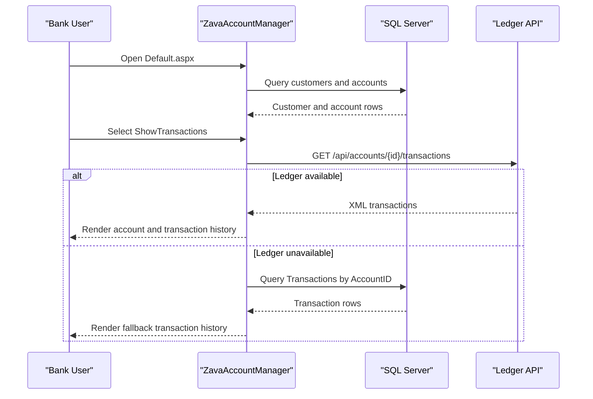

# API & Service Communication Contracts

The application exposes Web Forms page entry points and consumes downstream HTTP services for ledger and authentication workflows. Communication is primarily synchronous request-response.

## Service Catalog

| Service | Port | Category | Purpose |
|---|---:|---|---|
| ZavaAccountManager | 8080 (container) | API Layer | UI and account operations for bank staff |
| Zava Ledger API | 8080 (configured host `zava-ledger`) | Business | Returns balances and transaction history |
| ZavaAuthGateway | Not specified in repo | Infrastructure | External login/logout authority |

## API Endpoints Inventory

| Service | Method | Path | Request Type | Response Type |
|---|---|---|---|---|
| ZavaAccountManager | GET | /Default.aspx | Browser request with auth cookie | HTML page |
| ZavaAccountManager | GET | /Login.aspx | Query param `ReturnUrl` | HTML page with auth redirect link |
| ZavaAccountManager | GET | /Logout.aspx | Browser request | Redirect response |
| Zava Ledger API | GET | /api/accounts/{accountId}/balance | Path parameter `accountId` | XML balance payload |
| Zava Ledger API | GET | /api/accounts/{accountId}/transactions | Path parameter `accountId` | XML transactions payload |

## Management & Observability Endpoints

| Service | Endpoint | Custom Metrics (if any) |
|---|---|---|
| ZavaAccountManager | None detected | None detected |

## DTOs & Contracts

The application uses Web Forms controls and `DataTable` instances as contract carriers rather than explicit DTO classes. Ledger integration contracts are XML document structures (`balance`, `availableBalance`, and repeated `transaction` nodes) parsed into UI-bound tabular models. No OpenAPI, protobuf, or GraphQL contract artifacts were detected.

## Communication Patterns

Communication is synchronous via `HttpWebRequest` from page code-behind to the ledger service. If ledger transactions fail, the workflow falls back to querying local SQL transaction records, providing degraded but available data. Service discovery is URL-based through configuration values (`LedgerBaseUrl`, auth URLs). No API gateway, message queue, retry library, explicit timeout policy, TLS enforcement, or API-level authorization checks on outbound dependencies were detected.

## Service Technology Matrix

| Service | Web | Data Access | Discovery | Gateway | Actuator | Cache | Metrics |
|---|---|---|---|---|---|---|---|
| ZavaAccountManager | ASP.NET Web Forms | ADO.NET SQL + HTTP XML calls | Configured URLs | None | None | None | None |
| Zava Ledger API | External | Unknown | URL path from app config | N/A | Unknown | Unknown | Unknown |
| ZavaAuthGateway | External | Unknown | URL path from app config | N/A | Unknown | Unknown | Unknown |

## Service Communication Sequence

