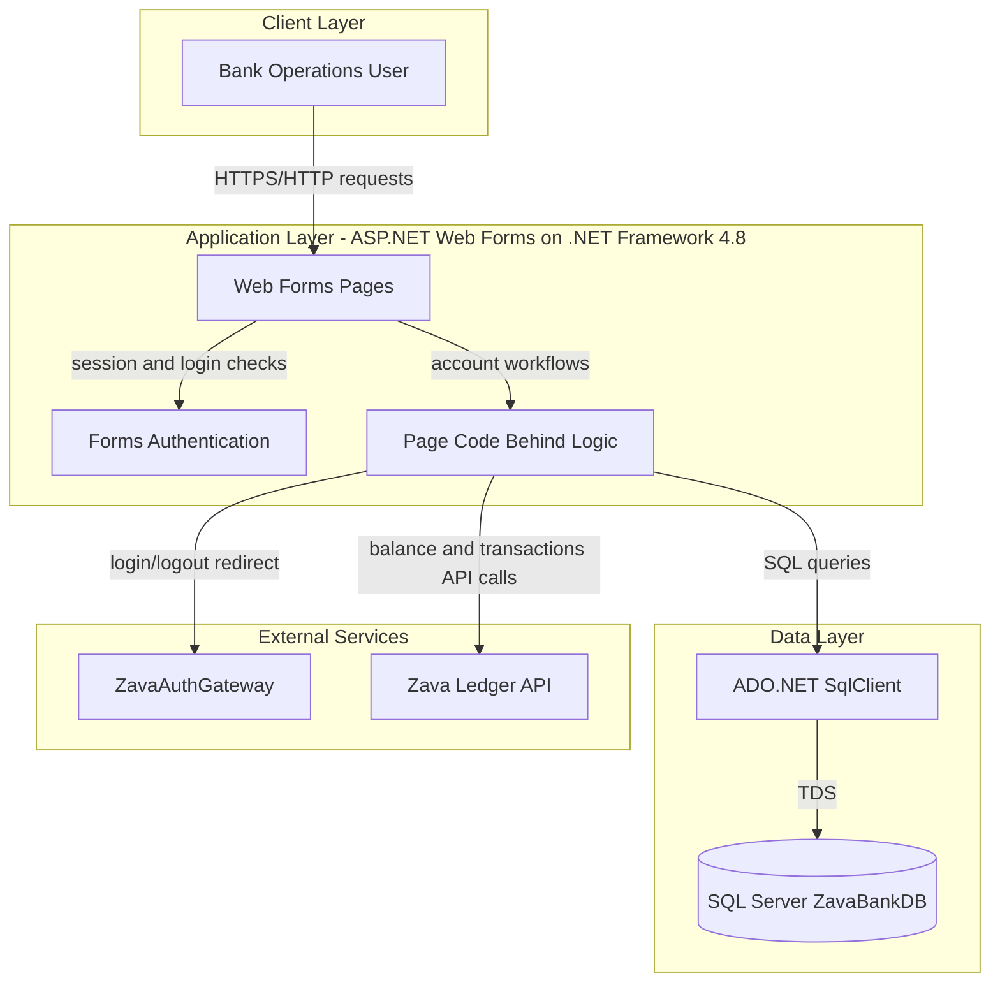
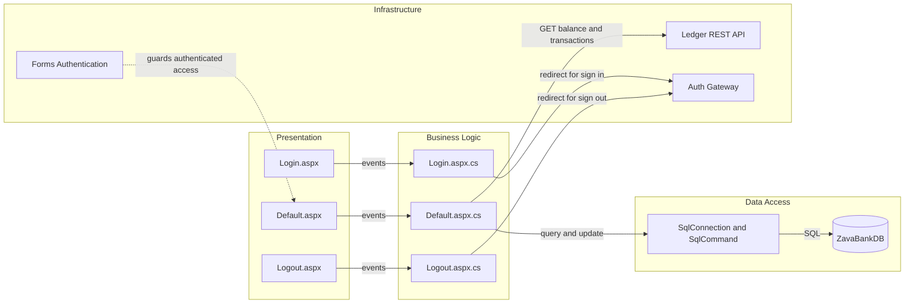

# Architecture Diagram

This document summarizes the application's runtime architecture and key component relationships.

## Application Architecture

### Technology Stack Summary

| Layer | Technology | Version | Purpose |
|---|---|---|---|
| Presentation | ASP.NET Web Forms | .NET Framework 4.8 | UI for customer/account operations |
| Application | Code-behind pages + Forms Auth | .NET Framework 4.8 | Business actions and access checks |
| Data Access | ADO.NET SqlClient | System.Data | Reads/writes customer/account/transaction records |
| Runtime | Mono + xsp4 (container path) | mono 6.12 | Linux container hosting option |

### Data Storage & External Services

The app stores operational data in SQL Server through a single connection string (`ZavaBankDb`). It also relies on external HTTP services for centralized authentication redirection and for account ledger balance/transaction retrieval.

### Key Architectural Decisions

- Uses server-side Web Forms with direct SQL access in code-behind rather than a separate repository/service layer.
- Uses forms authentication in `web.config`, with login/logout delegated to an external auth gateway URL.
- Implements resilient transaction display by falling back to local SQL transactions when remote ledger API calls fail.

## Component Relationships

### Component Inventory

| Component | Layer | Type | Responsibility |
|---|---|---|---|
| Default.aspx | Presentation | Web Forms Page | Main account management UI |
| Default.aspx.cs | Business Logic | Code-behind controller | Customer/account workflows, SQL and ledger calls |
| Login.aspx.cs | Business Logic | Code-behind controller | Redirects unauthenticated users to auth gateway |
| Logout.aspx.cs | Business Logic | Code-behind controller | Signs out and redirects to logout endpoint |
| SqlConnection/SqlCommand | Data Access | ADO.NET access components | Executes account/customer/transaction SQL |
| Forms Authentication | Infrastructure | Security middleware/config | Auth cookie handling and access control |
| Ledger REST API | Infrastructure | External service | Returns balance and transaction XML data |
| Auth Gateway | Infrastructure | External service | Centralized login/logout endpoints |
