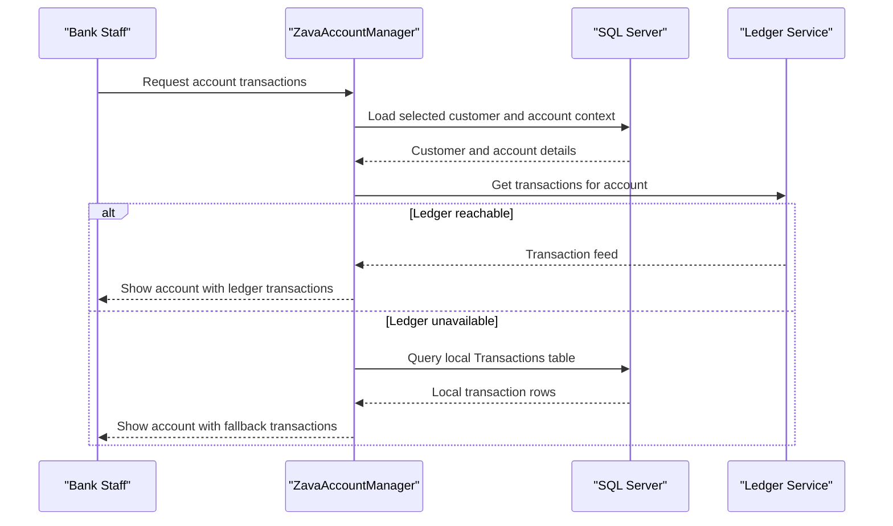

# Core Business Workflows

This application supports bank staff workflows for customer account administration and account activity visibility. The central workflow combines local account operations with external ledger retrieval.

## Domain Entities

| Entity | Service / Bounded Context | Description | Key Relationships |
|---|---|---|---|
| Customer | Account Management | Bank customer managed in account console | Customer owns multiple Accounts |
| Account | Account Management | Financial account lifecycle (open/close/view) | Account belongs to Customer and AccountType |
| AccountType | Account Management | Classification used when opening accounts | One AccountType maps to many Accounts |
| Transaction | Account Activity | Account activity record shown in history view | Transaction belongs to Account |

## Service-to-Domain Mapping

| Service | Domain Context | Owned Entities | External Dependencies |
|---|---|---|---|
| ZavaAccountManager | Account and customer operations | Customer, Account, AccountType, Transaction (fallback read path) | SQL Server, Ledger API, Auth Gateway |
| Zava Ledger API | Ledger read services | Ledger transaction and balance representations | Called by ZavaAccountManager for balance and history |

## Primary Workflows

### Workflow 1: Open Account for Existing Customer

1. Authenticated user selects customer and opens the account form.
2. Application validates customer ID, account type, and opening balance.
3. Application inserts a new `Accounts` record with generated account number and active status.
4. Updated account list is reloaded for the selected customer.

### Workflow 2: View Account Balance and Transactions

1. User selects an account action from the accounts grid.
2. For balance, the app calls the ledger balance endpoint and renders returned values.
3. For transactions, the app first calls the ledger transactions endpoint.
4. If the ledger call fails, the app falls back to local SQL transaction query and still returns history.

### Workflow 3: Close Account

1. User invokes CloseAccount action from the accounts grid.
2. Application updates account status to Closed and writes close/modified timestamps.
3. Application refreshes account list and shows operation status.

## Cross-Service Data Flows

The Web Forms application is the workflow orchestrator. It composes customer/account data from SQL Server and enriches account activity using ledger service responses. If ledger data is unavailable, business continuity is preserved by returning local SQL transaction history so users can still complete review workflows.

## Business Workflow Sequence

## Business Rules & Decision Logic

- Account opening requires valid numeric customer ID, account type ID, and opening balance; invalid input cancels the operation.
- Account close operation transitions state from active to closed and records close timestamp metadata.
- Transaction history retrieval applies resilience decision logic: remote ledger first, local SQL fallback on exception.
- Access control rule: unauthenticated users are redirected to login; authenticated access is required for account management pages.
