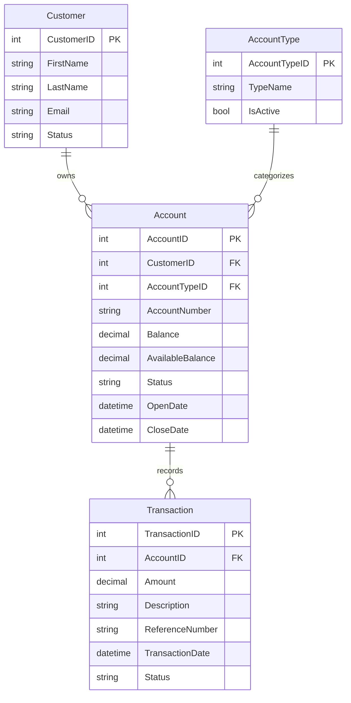

# Data Architecture & Persistence Layer

The data layer is centered on SQL Server accessed through ADO.NET, with additional read-path enrichment from a ledger HTTP service. Persistence logic is implemented directly in Web Forms code-behind.

## Database Configuration

| Service/Module | DB Type | Profile | Driver | Connection | Migration Tool |
|---|---|---|---|---|---|
| ZavaAccountManager | SQL Server | Default | System.Data.SqlClient | `Server=sqlserver,1433;Database=ZavaBankDB;...` from `web.config` | None detected |

## Data Ownership per Service

| Service | Tables Owned | ORM Framework | Caching | Notes |
|---|---|---|---|---|
| ZavaAccountManager | Customers, Accounts, AccountTypes, Transactions | ADO.NET (no ORM) | None detected | Direct SQL queries embedded in page code-behind |
| Zava Ledger API | Not owned in this repo | Unknown | Unknown | External service provides XML balance/transactions |

## Entity Model

## Key Repository Methods

| Service | Repository | Notable Methods | Purpose |
|---|---|---|---|
| ZavaAccountManager | Inline SQL in `Default.aspx.cs` | `SELECT TOP 20 ... FROM Customers` | Populate customer grid |
| ZavaAccountManager | Inline SQL in `Default.aspx.cs` | `SELECT ... FROM Accounts WHERE CustomerID=@c` | Populate account grid for selected customer |
| ZavaAccountManager | Inline SQL in `Default.aspx.cs` | `INSERT INTO Accounts (...) VALUES (...)` | Open new account |
| ZavaAccountManager | Inline SQL in `Default.aspx.cs` | `UPDATE Accounts SET Status='Closed' ... WHERE AccountID=@i` | Close account |
| ZavaAccountManager | Inline SQL fallback in `Default.aspx.cs` | `SELECT TOP 25 ... FROM Transactions WHERE AccountID=@a` | Fallback transaction history if ledger call fails |

## Caching Strategy

No explicit caching provider, cache regions, or cache policies were detected. Data reads are executed directly against SQL Server or fetched from the ledger API and immediately rendered.

## Data Ownership Boundaries

The application uses a shared persistence model where the Web Forms app directly reads and writes banking tables in one SQL Server database. Cross-service data enrichment occurs through ledger API calls for account balance and transactions, with local SQL fallback for transactions when the downstream service is unavailable.

### Data Classification & Sensitivity

| Entity | Sensitive Fields | Classification (PII/PHI/PCI/None) | Controls in Place |
|---|---|---|---|
| Customer | FirstName, LastName, Email | PII | Forms authentication and app access control; no explicit masking/encryption settings in repo |
| Account | AccountNumber, Balance, AvailableBalance | Confidential | App-level authenticated access; no explicit field-level encryption settings in repo |
| Transaction | Amount, Description, ReferenceNumber | Confidential | Access scoped via account views; no explicit masking/encryption settings in repo |
| AccountType | TypeName | None | N/A |
