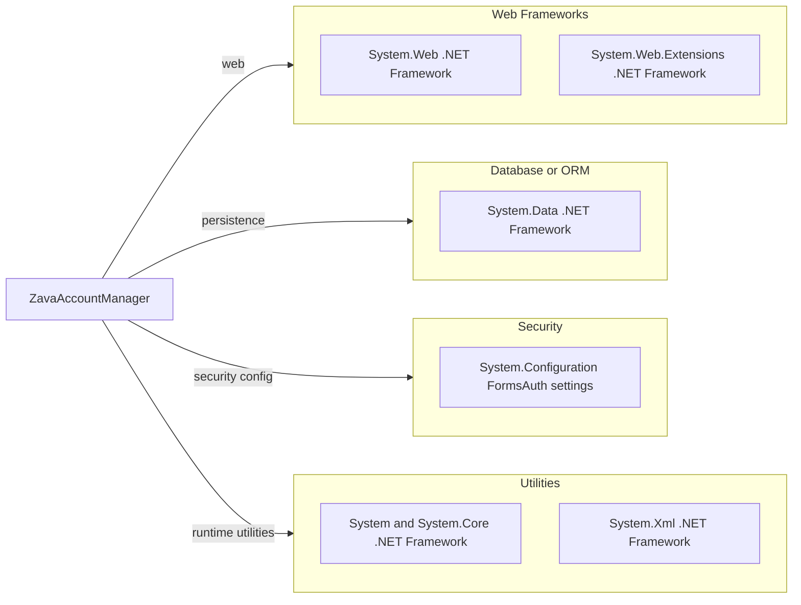

# Dependency Map

This project is a .NET Framework Web Forms application with a small declared dependency surface centered on framework assemblies and platform packages.

## Dependencies

### Dependency Summary

| Category | Count | Key Libraries | Notes |
|---|---:|---|---|
| Web Frameworks | 2 | System.Web, System.Web.Extensions | ASP.NET Web Forms stack |
| Database or ORM | 1 | System.Data | Direct ADO.NET usage |
| Security | 1 | Forms authentication in System.Web config | Cookie-based auth flow |
| Utilities | 3 | System, System.Core, System.Xml | Base runtime and XML handling |

### Version & Compatibility Risks

The project targets .NET Framework 4.8, which is Windows-centric and requires framework targeting packs for build in non-Windows environments. Modernization to a supported .NET target will require migration from Web Forms and reassessment of direct ADO.NET patterns.

### Notable Observations

- `packages.config` contains no NuGet package entries, indicating near-complete reliance on framework assemblies.
- A Docker path uses Mono runtime, which differs from the native Windows .NET Framework runtime behavior.
- No dedicated observability or resilience libraries are declared in build/package files.

## Test Dependencies

| Framework | Version | Notes |
|---|---|---|
| None detected | N/A | No test framework dependencies found in build/package files |

Total test-scope dependencies: 0
No test dependencies were detected in the project configuration files.
